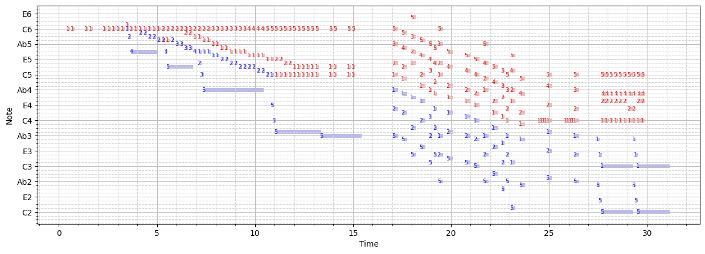
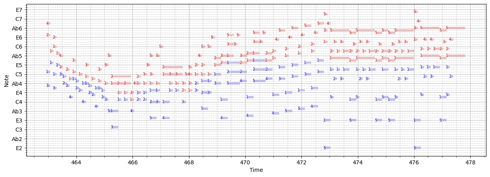

# Pianofortis

A very early-in-development AI tool that builds a physical model of the piano and the pianist, using constraint programming to find optimal hand divisions and fingerings for notes & chords in a given MIDI file.

When complete, the tool will be capable of dividing a MIDI into a left/right-hand part and assign fingerings to every note. Most importantly, it will gauge the playability of chords, awkward/impossible passages for the fingers, and assign difficulty scores to every part of a score.

Currently, the tool is mostly complete in the location dimension - it can find the best hand assignments and fingerings for a single chord. However, it is lacking in the time dimension - right now it can't really consider previous and next notes that well.

Below are some predictions on a piano arrangement of Rachmaninoff's first Symphonic Dance, arranged by me.

